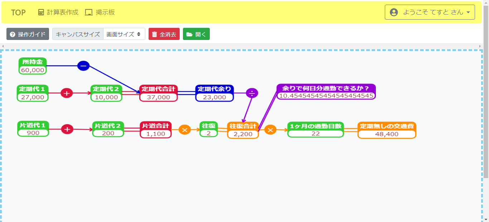

# 計算表作成サイト
電卓でちょっとした計算をしている時、さっき使った数値をまた使いたくなった事がありませんか？ 
でもExcelとか使うほどじゃ…って事が多いなら、是非このサイトを利用してみて下さい！！

## 出来る事
・キャンバス上に数値を配置し、簡単な四則演算を使用した計算表が作成出来ます。 
・掲示板から他人が作成した計算表を使用出来、また自身の作成した計算表を掲示板へ投稿して共有する事も出来ます。

## 使用したもの

展開

### 開発環境
- Eclipse
- Visual Studio Code（計算表のJavaScript部分やHTMLとCSSの動作テスト）

### 使用言語
- Java
- HTML
- JavaScript
- CSS
- SQL

### フレームワーク
- springboot ver2.7.6

### 主な使用ライブラリ
- jquery ver3.5.1
- MyBatis ver2.1.4
- SpringSecurity
- Thymeleaf

#### その他見た目要素
- bootstrap ver4.5.3
- dataTables
- font-awesome

